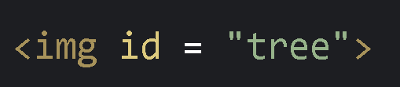
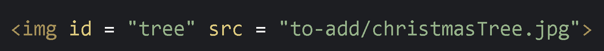
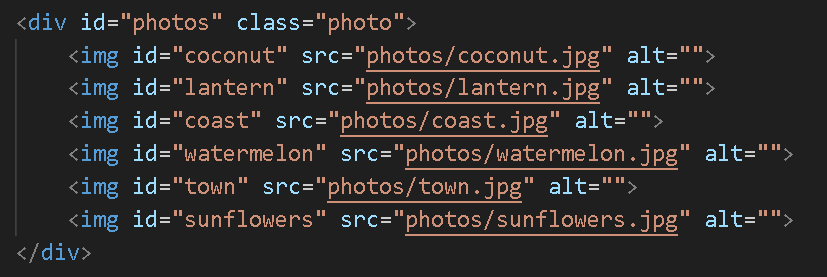

# Photo Album
Using javascript and DOM, change a photo album with the click of a button!


## The Task
You are starting off with a photo album website that is supposed to be filled with winter pictures, but there are some summer pictures in there. 
There is a button on the top that says "fix" that will run a javascript function on click. **It is your job to create the fix function.**
The fix function will use DOM to remove the summer pictures, as well as add some new winter pictures, using some of the photos in the winter folder.


## Part 1: Removing The Summer Photos
We start off with four photos that we need to remove. These photos are located in the 'photos' folder in the project.

✅ The first image we will remove will be the coconut, which is located at 'photos/coconut.jpg'. Create a variable called 'coconut', and use `document.getElementById()` to grab the coconut img (id is "coconut"!)

✅ We want to delete this coconut picture, since we're supposed to have a winter photo album here! Now that we've stored the coconut img into a variable, use `.remove()` to remove it from the website!

```JavaScript
//To use .remove(), type the variable name that you want to remove, and add .remove() in front of it
//For example...
let element = document.getElementById("element");
element.remove()
```

Repeat these steps for the next three photos, which are 'coast.jpg', 'watermelon.jpg', and 'sunflowers.jpg'. If you want to see if everything works, refresh the page and press the fix button. 

✅ Remove the coast image

✅ Remove the watermelon image

✅ Remove the sunflowers image

## Part 2: Adding Winter Photos
Now, all of the summer photos are gone, and we can start adding in some winter photos. Three winter photos are already provided in the 'to-add' folder in the project.

### Creating the img elements

The process of creating new document elements is very similar to what we've done so far. It's like using `document.getElementById()`, but instead it's with `document.createElement()`! For `createElement("")`, you want to put the name of the HTML tag you want to create, like "img", "p", "h1", "div", etc.

✅ Create a new "img" element, and store it in a variable named `tree`.


With this, we have created a new image element, but it has no attributes, and would look something like this:


Yeah, we need to give this img element some attributes first. Let's give it an id first element, so we can refer to it later if we ever need to. This is really easy because if you remember, all we did was create an object! If we want to give an object a new property, just use dot notation to add it!

✅ Give your new element the id of "tree"

```
tree.id = "tree";
```

Now our new img element would look something like this:




✅ Next, since we're working with an img element, we need to give it the src of the image we want. There's a Christmas Tree image located in the `to-add` folder, so set our new element's `src` property to the file path of the image.

We should have built up an img element that would look like this in HTML:



### Adding our new elements to the HTML

Now that our tree element is ready to go, we need to append it to an existing object in the HTML in order for it to show up. The best place to append elements to is usually a divider of sorts, so let's take a look at the HTML to see where we should put it:



It looks like all of the images were stored inside a `div` container with the ID `photos`, so let's grab that div into our JavaScript so we can attach our new elements to it.

✅ Use `document.getElementById()` to set the photos divider to a variable.

Now, we can use the `.appendChild()` function to add our new tree image into the photos divider section.

✅ Use `.appendChild()` to add the tree image element to the HTML

```JavaScript
//To use .appendChild(), first type the parent element that you want to give the child to. Then add .appendChild(), and inside the paranthesis put the variable name of the element to add.
//For example...
let parent = document.getElementById("parent");
let element = document.getElementById("element");
parent.appendChild(element);
```

✅ Test your button!

Congrats! You've just created a new img element entirely in JavaScript, and added it to your HTML! Repeat these steps two more times for two more photos, the snowmen and stockings photos inside the `to-add` folder.

✅ Add the snowmen image

✅ Add the stockings image

Now when we click on the fix button, we should have replaced all the summer photos with winter photos!

